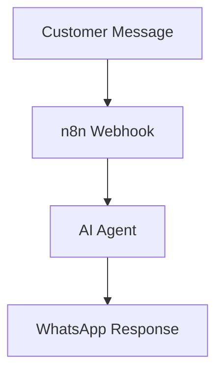

# Generate Mermaid Code

An AI-powered n8n workflow that converts workflow or project descriptions into Mermaid diagram code.

## Features

* AI-generated Mermaid diagrams
* Workflow visualization
* Process documentation
* Technical architecture diagrams
* Copy-ready Mermaid code

## Workflow

```text
Description
     ↓
AI Analysis
     ↓
Mermaid Generation
     ↓
Validate / Format
     ↓
Mermaid Code
```

## Example Input

```text
A customer sends a WhatsApp message.
The message is received by n8n.
The AI analyzes the message.
The response is sent back to the customer.
```

## Example Output



## Use Cases

* Workflow documentation
* Technical diagrams
* Architecture visualization
* README documentation
* Client presentations

## Requirements

* n8n
* AI provider

## Setup

See [`setup.md`](setup.md).
